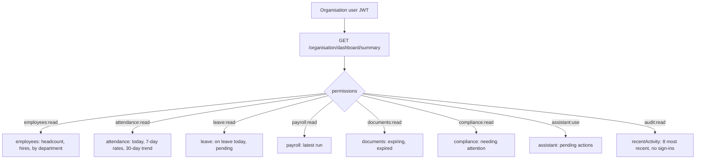

# Organisation Desktop — Dashboard

**Status: built, verified against real data in a headless Chrome (dark and
light themes) and by independently recomputing figures in SQL.**

`/dashboard` is now the landing page of Organisation Desktop (sign-in and
the catch-all route both go there). Until this, the app had no home page at
all — it dropped you onto `/employees`.

It follows a design mockup the project owner supplied, with one rule
applied throughout: **a widget exists only if it can be backed by real
data.** That decided which parts of the mockup were built and which weren't.

## Mockup → reality

| Mockup widget | Built as | Backed by |
|---|---|---|
| Total Employees (+% vs last month) | **Total employees** — "N joined this month" | `employees` (not terminated), `hireDate` |
| Present Today (83.3% attendance) | **Present today** — count, rate, 14-day sparkline | `attendance_records` vs current headcount |
| On Leave | **On leave** — count, % of workforce | approved `leave_requests` covering today |
| Open Tasks (5 overdue) | **Pending leave requests** | `leave_requests` with status `PENDING` |
| Workforce Overview line chart | **Attendance overview** — present per day, 30 days | `attendance_records` |
| Department Distribution donut | **Department distribution** — top 5 + Others | `employees` grouped by `departmentId` |
| Recent Activities | **Recent activity** | `audit_logs`, this organisation only |
| AI Insights | **Insights** — two computed comparisons | attendance (7 days vs prior 7), hiring (this month vs last) |
| Announcements | *not built* | no announcements feature exists |
| My Tasks | **Needs your attention** (real counts, linked) | leave, documents, compliance, assistant actions |
| Upcoming Events / calendar | *not built* | no events/calendar feature exists |
| (none) | **Payroll** — latest run, net pay, disbursement status | `payroll_runs` |
| Search / notification bell in the header | *not built* | no global search or notification system exists |

Announcements, Tasks, Events and global search are separate product features
that don't exist in NEXORA. Rendering them would have meant inventing
numbers, so they were left out at the project owner's direction rather than
faked. The **Insights** card is deliberately *not* branded as AI: those are
plain comparisons computed from the organisation's own records, and the
assistant behind them is still an honest placeholder — labelling arithmetic
"AI" would misrepresent what's producing it. The card says "Computed from
your attendance and HR records".

## One endpoint, sections gated by the caller's own permissions

`GET /organisation/dashboard/summary` returns only the sections the caller's
JWT permissions unlock — the same pattern as the platform dashboard — so a
user without `payroll:read` never receives payroll figures even though the
endpoint is shared. Tenancy comes from the caller's JWT
(`CurrentOrganisationId`), never a parameter; a platform token gets
`403 ORGANISATION_ONLY`, no token gets `401`.

`audit:read` is a new permission ("View the organisation's recent activity
log on the dashboard"). The activity feed excludes sign-in events — they are
audit-logged, correctly, but would push every real business event out of an
eight-item window. Platform staff who acted on an organisation appear as
"NEXORA Platform" rather than by name; an organisation has no business
seeing individual SAPOK TECH staff identities.

## Definitions worth knowing

- **Headcount** is everyone not `TERMINATED`.
- **Present** means `PRESENT`, `LATE` or `HALF_DAY`. Today's rate is present
  ÷ current headcount, so someone whose attendance hasn't been entered yet
  counts as not present.
- **A day with no attendance recorded is `null`, not 0.** The trend and the
  7-day rates only count days that have at least one attendance row, so
  weekends and holidays aren't drawn as a crash to zero or averaged in as
  mass absence. (An earlier version zero-filled these; the first render
  showed exactly that false dip, which is why it changed.) A day where rows
  exist and everyone was `ABSENT` correctly counts as 0.
- **7-day rates** compare the last 7 calendar days (today included) with the
  7 before, each against *current* headcount — an approximation if headcount
  changed inside the window.
- Dates are UTC calendar days, matching how `@db.Date` columns are stored.

## Behaviour

- Refetches every 60 seconds and on window focus, so it stays current while
  left open.
- Loading skeleton, an error state with Retry, and an empty state for a role
  that unlocks no sections.
- Themed with the app's HSL tokens; checked in dark and light.
- The dashboard route is lazy-loaded: `recharts` is a chunk fetched after
  sign-in instead of doubling the login screen's first load (the main bundle
  stays ≈451 kB; the dashboard chunk is ≈439 kB).
- Tiles link to their module; the "Needs your attention" rows link to the
  page that resolves them and only list items that are non-zero.

## Verified

Seeded a real organisation through the API (4 departments, 14 employees, 12
days of attendance, approved and pending leave, three documents, a
past-due compliance item, a payroll run, a proposed payroll disbursement),
then:

- The endpoint's numbers matched the seed by hand (14 employees, 12 of 14
  present = 85.7%, 1 on leave, 2 pending, 1 document expiring and 1
  expired, 1 compliance item, 1 pending assistant action).
- After varying the attendance data, the "+8.6 pts" insight was recomputed
  independently in SQL (81.4% vs 72.9% → 8.57 unrounded) and agreed.
- A role holding only `employees:read` received only the `employees`
  section and a sidebar reduced to Dashboard + Employees; a role holding
  only `assistant:use` received only `assistant`.
- Through the real sign-in form in headless Chrome: lands on `/dashboard`,
  no console errors or failed requests, correct in dark and light.
- Type-checks and production-builds cleanly (desktop and Control Center).

Reviewing the first render surfaced four defects, all fixed before this
doc was written: a department legend clipped by a narrow card, a feed
drowned in "login success" rows, an unchanged attendance rate shown as a
green "up 0.0 points", and the weekend dips above. It also surfaced a
missing favicon (a console 404 that predated this work).

## Known gaps

- No announcements, tasks, events/calendar, global search or notifications
  (see the mapping above) — separate features, not dashboard work.
- Rates use current headcount as the denominator (see above); there is no
  historical headcount snapshot.
- The recent-activity feed shows raw audit actions humanised
  ("Payroll run created"), not bespoke sentences per event.
- Not opened inside the Tauri shell (no Rust toolchain on this machine);
  checked in Chrome, which is what the Vite build targets.
