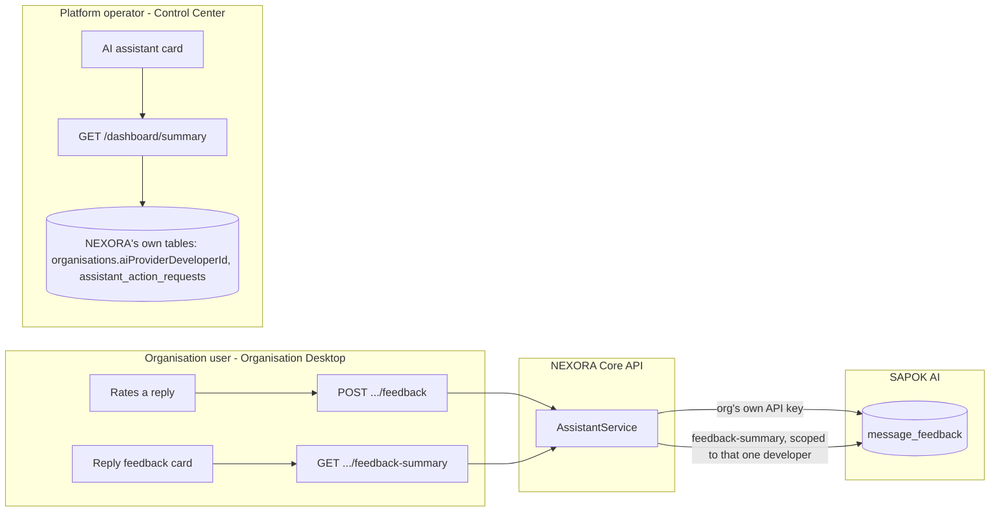

# Phase 10 — NEXORA Intelligence Platform

**Status: complete for feedback and evaluation; training data and a model
registry are deliberately not built here — see below for why.**

The roadmap line reads "feedback, evaluation, training data, model
registry." Read honestly against what actually exists, those four are not
equally real today, and this phase builds only the ones that are.

| Roadmap item | What it means here | Built? |
|---|---|---|
| Feedback | An organisation user rates an assistant reply | **Yes** |
| Evaluation | An organisation sees its own reply-quality trend; the platform operator sees adoption and action volume | **Yes** |
| Training data | Exporting accumulated conversations for a future in-house model | **No — and it must not live in NEXORA** |
| Model registry | Tracking multiple trained model versions | **No — nothing to register yet** |

## Feedback

`AssistantService.submitMessageFeedback` proxies to SAPOK AI's own
`message_feedback` (its Phase 12), using the organisation's cached API key.
SAPOK AI upserts — one row per message — so changing your mind re-rates the
same row rather than stacking a second one, and it only accepts ratings on
`assistant`-role messages and only inside a conversation the calling
developer account owns.

- `POST /organisation/assistant/conversations/:id/messages/:messageId/feedback`
  `{ rating: "UP" | "DOWN", comment? }` — gated by `assistant:use`.
- The Assistant page shows thumbs up / thumbs down under every assistant reply.

## Evaluation — two audiences, two deliberately different data sources

**An organisation sees its own feedback.** SAPOK AI already had
`GET /admin/feedback-summary`, but it aggregates *every* developer on the
platform and is admin-only — correct for SAPOK AI's operator, the wrong
thing to hand a single tenant. So SAPOK AI gained a tenant-scoped
counterpart, `GET /conversations/feedback-summary` (joined through
`conversations.developer_id`), and `GET /organisation/assistant/feedback-summary`
proxies it. One SAPOK AI developer account per organisation means "scoped
to the developer" is exactly "scoped to the organisation".

**The platform operator sees adoption and action volume — from NEXORA's own
data.** The platform `DashboardSummary` gained an `assistant` section
(gated by `organisations:read`, like the organisations section): how many
organisations have provisioned the assistant, and proposed actions by
status and by tool. It is computed entirely from tables NEXORA owns. It
deliberately does *not* call SAPOK AI's admin endpoints — see the next
section.

## Training data: intentionally absent from NEXORA

SAPOK AI's `GET /admin/training-data/export` exports conversation text
across **every** developer on the platform. NEXORA holds no SAPOK AI admin
credential (only per-organisation developer API keys and the service
secret), and it must not acquire one to power a NEXORA screen: doing so
would put other tenants' conversation text — including any non-NEXORA
product built on SAPOK AI — one permission mistake away from a NEXORA
platform admin's browser. That export stays a SAPOK AI platform-operator
concern, reached through SAPOK AI's own admin login.

## Model registry: nothing to register

There is exactly one provider, `PlaceholderProvider`, which is honest
scaffolding and not a model. A registry of trained model versions with one
entry that isn't a model would be exactly the kind of premature structure
this project has declined to build at every other phase. When a real
trained model exists, versioning it is a real design question with real
inputs; until then it's a known gap, not a stub.

## Also fixed here: `SUPER_ADMIN` roles silently missed new permissions

Adding the `audit:read` permission for the dashboard exposed a latent
defect: `OrganisationRbacService.ensureSuperAdminRole` gives the system
`SUPER_ADMIN` role ("Full access within this organisation") the whole
permission catalog **only when the role is first created**. Every
permission added to the catalog afterwards — `assistant:use`,
`assistant:manage_knowledge`, `audit:read` — never reached any organisation
that already existed. Reseeding reported 14 pre-existing `SUPER_ADMIN`
roles in the dev database that were missing them.

`prisma/seed.ts` now tops every organisation `SUPER_ADMIN` role up with the
full catalog on each run (idempotent, `skipDuplicates`), so the role keeps
meaning what its description says. A production deployment needs the same
top-up run as part of its migration/seed step whenever the catalog grows.

## Verified end-to-end

All three services running for real (Core API, SAPOK AI, Postgres for each),
through the real UI in a headless Chrome for the UI paths:

- Rated an assistant reply DOWN via the API (and re-rated it, confirming
  the API returned the same feedback id), then clicked **Helpful** in the
  browser. The Reply feedback card afterwards showed 1 up / 0 down, 100%
  helpful — a single rated message, not two, so the click updated the
  existing rating rather than adding one.
- Feedback on a *user* message was rejected (`400`, "only assistant
  messages"); an invalid rating (`SIDEWAYS`) was rejected (`400`); a user
  holding a role without `assistant:use` got `403 MISSING_PERMISSION`.
- The org's `feedback-summary` returned only that organisation's ratings.
- Control Center, logged in as platform admin, rendered the new AI assistant
  card ("Organisations using the assistant: 1 of 18", one pending
  `disburse_payroll_run` action), rendered from `GET /dashboard/summary`.
- SAPOK AI's suite passes at 58 tests, including a new one asserting a
  second developer's feedback summary comes back empty.

## Known gaps

- The thumbs highlight reflects only what was clicked in this session; SAPOK
  AI has no "my rating for this message" read, so reopening a conversation
  doesn't re-highlight a rating made earlier.
- Feedback is a rating plus an optional comment. There's no structured
  rubric and no comment listing — nothing consumes richer data yet.
- Training-data export and a model registry: see above; both wait on a real
  trained model existing.
