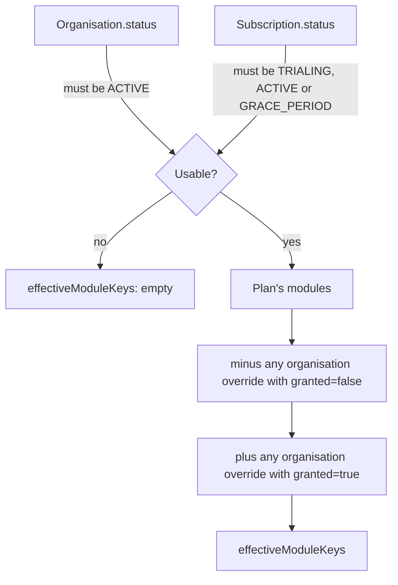
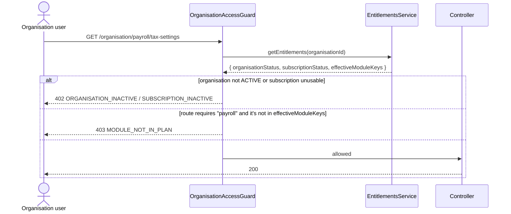

# Phase 11 — Module Entitlement & Organisation Access Control

**Status: built and verified end-to-end over real HTTP against the running
stack (19/19 checks — module gating, per-organisation overrides, and the
organisation-suspend kill switch, including recovery from each).**

Phase 3 built Plans, Modules and Subscriptions and said so explicitly in its
own "Known gaps" section: *"Module entitlement enforcement (actually
blocking access to a module an org's plan doesn't include) isn't built —
that's meaningful once Phase 5's business modules exist to gate."* Phase 5
has existed for a while. This phase closes that gap, and a second one found
alongside it: `Organisation.status` (`organisations:manage_status`) was
manageable from the Control Center but **never checked anywhere** — a
platform admin could mark an organisation `SUSPENDED` and every one of its
users would carry on completely unaffected.

This is also the direct answer to *"is the control panel actually in
charge of what an organisation can do."* Before this phase, Plans and
Subscriptions were bookkeeping — real rows, correctly computed, connected to
nothing. After it, they gate every business API call, and the Control Center
can fine-tune access per organisation, not just per plan.

## What "entitled" means

One computation — `EntitlementsService.getEntitlements` — is the single
source of truth, read by the guard that enforces it, by the organisation's
own "why am I locked out" summary, and by the Control Center's access
preview. Nothing else re-derives this logic.

- **The organisation itself must be `ACTIVE`.** `PENDING`, `SUSPENDED` or
  `ARCHIVED` zeroes every module, full stop — this is the platform's own
  kill switch, and it now actually switches something off.
- **The subscription must be usable.** `TRIALING`, `ACTIVE` and
  `GRACE_PERIOD` all grant the plan's modules — grace period is "overdue,
  not yet cut off," matching the lifecycle Phase 3 already defined.
  `SUSPENDED`, `CANCELLED`, or no subscription at all grants nothing.
- **`OrganisationModuleOverride`** (new model) is the fine-tuning lever: a
  row with `granted: true` adds a module the plan doesn't include (an
  add-on, a pilot); `granted: false` withholds one the plan does include
  (e.g. disabled mid-dispute without moving the whole organisation off its
  plan). No row means "do whatever the plan says."

## Enforcement

`OrganisationAccessGuard`, applied via `@UseGuards(PermissionsGuard,
OrganisationAccessGuard)` on every organisation-scoped controller — the same
per-controller pattern `PermissionsGuard` already uses, and for the same
reason stated in its own header comment: Nest guarantees a controller-level
guard runs after the global `JwtAuthGuard`, so `request.user` is already
populated. (Deliberately *not* a second global `APP_GUARD` — Nest doesn't
document relative ordering between two independently-registered global
guards, and this codebase already has a proven-correct pattern for exactly
this problem.)

Two independent checks, in order:

1. **Is the organisation usable at all** (`OrganisationAccessGuard`'s own
   job, always runs) — `402 ORGANISATION_INACTIVE` or `402
   SUBSCRIPTION_INACTIVE` if not, on every route, regardless of
   `@RequireModule`. `@AllowWhenInactive()` exempts the handful of routes a
   locked-out organisation still needs (its own billing summary, so it can
   see *why*).
2. **Does a `@RequireModule("key")`-tagged route's module appear in
   `effectiveModuleKeys`** — `403 MODULE_NOT_IN_PLAN` if not, naming the
   missing module and the current plan in `details`.

Applied with `@RequireModule(...)`: employees, attendance, leave, payroll,
documents, compliance, assistant. Applied WITHOUT a module requirement (the
base organisation-active check only — these aren't things a plan gates,
they're the organisation running itself): organisation-structure,
organisation-users, organisation-rbac, organisation-dashboard.

## API surface (new)

| Method | Path | Permission | Notes |
|---|---|---|---|
| GET | `/organisation/billing/summary` | none (`assistant:use`-style: any org user) | The org's own view of its plan. `@AllowWhenInactive()`. |
| GET | `/organisations/:organisationId/entitlements` | `billing:read` | Platform-side access preview — the exact computation, live. |
| PUT | `/organisations/:organisationId/entitlements/:moduleKey` | `billing:manage_overrides` (new permission, SUPER_ADMIN only — same reasoning as `billing:manage_plans`) | `{ granted: true \| false \| null }` — `null` clears the override. |

Migration: `20260927115728_phase11_module_entitlements` (adds
`OrganisationModuleOverride`).

## Frontend

**Organisation Desktop.** `AppShell` (every page's shared wrapper) now
fetches the organisation's entitlements alongside its permissions:

- Nav items carry an optional `moduleKey` and are hidden if the plan doesn't
  include it — independent of whether the user's *role* has the matching
  permission (a `SUPER_ADMIN` role holds every organisation permission by
  design, regardless of what the organisation actually pays for; module
  filtering is what actually reflects billing).
- A gated page (`<AppShell requiredModule="payroll">`) shows a clean "Not
  included in your plan" screen instead of a wall of failed API calls if
  reached directly.
- If the organisation itself isn't usable, `AppShell` replaces the entire
  app with a lockout screen naming why (`PENDING` / `SUSPENDED` / `ARCHIVED`
  / subscription inactive) — every API call would 402 anyway, so this is
  honest rather than a broken-looking app.
- `GRACE_PERIOD` is non-blocking — an amber banner instead, naming the date
  access will actually stop.
- The dashboard's own optional sections (payroll, documents, compliance,
  assistant, and the base employees/attendance/leave tiles) are filtered by
  the same entitlements, so a Starter-plan organisation's SUPER_ADMIN
  doesn't see a Payroll card that links to a page they'd immediately bounce
  off. A small "Your plan" card lists the plan name, renewal date and every
  currently-included module.

**Control Center.** The organisation detail page gained an **Access
control** card — the full module catalog, each row showing whether it's
included (plan default or override) and, for `billing:manage_overrides`
holders, three buttons per module (*Plan default* / *Force on* / *Force
off*) that write directly through `EntitlementsService`. This reads the
exact same computation the guard enforces with — it is not a separate
"preview" that can drift from reality.

## Verified end-to-end over real HTTP

A Node script against the running stack (no mocks): created a fresh
organisation, assigned it the **Starter** plan (`employees`, `attendance`,
`leave` — no `payroll`), logged in as its admin. Confirmed `employees` (in
plan) returns `200` and `payroll` (not in plan) returns `403
MODULE_NOT_IN_PLAN`. Force-granted `payroll` as a platform-side override —
confirmed the same call now returns `200`. Suspended the organisation via
the pre-existing (and previously inert) `organisations:manage_status` —
confirmed `employees` now returns `402 ORGANISATION_INACTIVE` **despite
being in-plan**, and that the organisation's own `/organisation/billing/summary`
still answered (`@AllowWhenInactive()`) showing `effectiveModuleKeys: []`.
Reactivated — access returned immediately. Cleared the override — `payroll`
went back to `403`. 19/19 checks passed.

**Regression tests**, no database or network:
`src/billing/entitlements.service.spec.ts` (13 tests — the computation:
plan-only, grants, revokes, organisation-inactive-zeroes-everything,
subscription-status matrix, missing-organisation, override CRUD) and
`src/common/guards/organisation-access.guard.spec.ts` (9 tests — the
enforcement: platform-caller no-op, allowed path, both 402 cases,
`@AllowWhenInactive()`, `MODULE_NOT_IN_PLAN` with its `details`). Checked to
actually catch the bug the same way Phase 8's did: with the guard's lockout
branch temporarily disabled, 5 of 9 guard tests failed — restored, all 9
pass.

## Known gaps / deferred on purpose

- Overrides are per-module booleans, not time-boxed — a "payroll for 30
  days" pilot needs a human to remember to clear it. An expiry field is a
  reasonable follow-up if this gets used for real trials.
- No email/notification when an organisation enters `GRACE_PERIOD` or gets
  suspended — the organisation only finds out by hitting the UI. Same
  "no worker process started yet" limitation Phase 3 already named.
- The Control Center's Access control card doesn't yet show *who* set an
  override or *when* beyond the audit log (`ORGANISATION_MODULE_OVERRIDE_*`
  entries exist and are queryable via the existing Activity card, just not
  surfaced inline on the override row itself).
