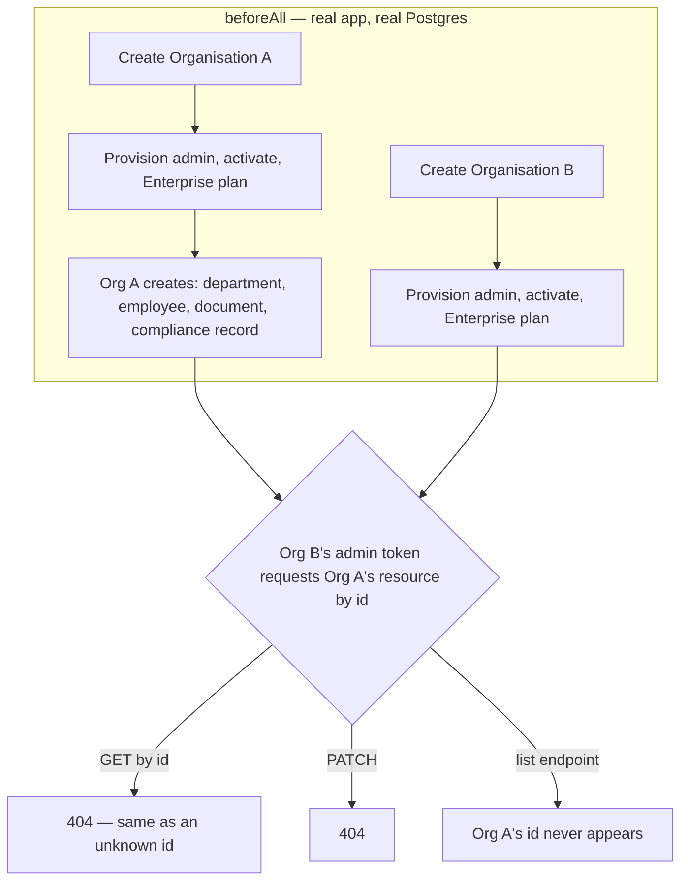

# Phase 12 — Security + Quality

**Status: e2e test infrastructure built (Core API's first), tenant isolation
and RBAC verified against the real running stack (26/26), payroll tax math
and the AI actions maker-checker guarantee covered by hand-verified unit
tests (22/22). Full-stack load testing not attempted for real — see
"Known gaps."**

Every prior phase verified its own feature end-to-end as it was built.
Phase 12 is different: it doesn't add a feature, it goes back across
*everything already built* and proves the cross-cutting guarantees the
whole platform depends on actually hold — tenant isolation, RBAC, and
financial correctness — with real, repeatable tests, not one-off manual
probes (that's how Phase 8's two vulnerabilities were found: manually,
after the fact). This phase is what turns "I checked it once" into "there's
a test that checks it every time."

## New: e2e test infrastructure

Core API had unit tests (mocked Prisma/`fetch`, no real I/O) but nothing
that booted the actual app. `test/utils/e2e-app.ts` does that — a real
`AppModule` via `@nestjs/testing`, real Postgres, real Redis, driven with
`supertest` — and `test/utils/fixtures.ts` wraps the repetitive setup
(create an organisation, provision its admin, activate it, put it on a
plan, log in) so each spec file focuses on what it's actually testing.

Separate from the unit suite on purpose (`jest-e2e.config.js`, run via
`pnpm test:e2e`, not part of the default `pnpm test`): these need the dev
stack actually running (`docker compose up -d` equivalent) and are slower,
so they don't belong in a fast inner-loop `pnpm test`.

## Tenant isolation (`test/tenant-isolation.e2e-spec.ts`, 13 tests)

Two real organisations, both fully entitled (Enterprise plan, so Phase 11's
module gating is never what's blocking a request here — only tenant
scoping is under test). Org A creates a department, employee, document and
compliance record; every test then tries to reach that resource **as Org
B's own SUPER_ADMIN** — full permissions, just the wrong organisation — and
confirms:

- Reading or updating it by id: `404`, identical to a made-up id (never
  `403`, which would confirm the resource exists somewhere).
- Listing the resource type: Org A's row never appears in Org B's list.
- Org B's dashboard summary reflects only Org B's (empty) data.
- A **platform** token can't reach an organisation route either way it
  might try: `403 ORGANISATION_ONLY` on a route with no permission
  decorator (the `CurrentOrganisationId` scope check itself), and `403
  MISSING_PERMISSION` on one that has one (a platform user's JWT simply
  holds none of the organisation permission catalog).

**Deliberately excluded**: the assistant/knowledge routes. Those proxy to
SAPOK AI — a separate service this repo's own test setup doesn't start —
and cross-tenant isolation there is enforced by a structurally different
mechanism (one SAPOK AI API key per Organisation, not a Prisma
`organisationId` filter), which `assistant.service.spec.ts` already covers
with mocks, alongside the actual permission bugs Phase 8 found and fixed.
Making this suite depend on a sibling service being started would trade
real coverage for a fragile precondition, for a guarantee already tested a
different, more appropriate way.

**Not separately re-tested**: attendance and leave. Same guard, same
`CurrentOrganisationId` derivation, same controller shape as employees —
the pattern is what's being proven, and it's proven by employees,
documents, compliance and departments together. Payroll is architecturally
different (touches SAPOK Pay) and is named explicitly in "Known gaps"
below rather than silently assumed covered.

## RBAC enforcement (`test/rbac.e2e-spec.ts`, 13 tests)

One organisation, three identities: the SUPER_ADMIN (everything), a role
created with **zero** permissions, and a role created with **exactly**
`employees:read`. Against 11 real mutating/reading routes spanning
employees, attendance, leave, payroll, documents, compliance, departments,
users, roles and assistant knowledge:

- The zero-permission role gets `403 MISSING_PERMISSION` on every single
  one.
- The `employees:read`-only role **can** list employees (200) but **still
  cannot** create one (403) — proving the check isn't all-or-nothing.
- The organisation's own SUPER_ADMIN **can** create an employee — the
  positive control that proves the whole suite isn't vacuously passing by
  blocking everything regardless of permissions.
- No token at all is rejected (`401`) before any permission logic runs.

## Financial correctness (`src/payroll/payroll-tax.util.spec.ts`, 11 tests)

Unit tests against the actual seeded Nigeria tax bands
(`prisma/seed.ts`'s `NG_TAX_BANDS`), with every expected figure **computed
by hand first**, not copied from a debug run:

- Income entirely inside the 0% band → zero tax, including at the exact
  boundary (₦800,000).
- A boundary crossing charges the new rate only on the *marginal* amount
  over the boundary — not the whole income at the new rate (the single
  most common progressive-tax bug).
- A mid-range income spanning 3 bands, and a high income spanning all 6
  including the unbounded top band, both matched by hand.
- Pension (8% NG default) deducted before PAYE, floors at zero rather than
  going negative if a rate is misconfigured above 100%, and a ₦0 salary
  produces a ₦0 payslip rather than `NaN` or a thrown error.

## AI security / maker-checker (`src/assistant/assistant-actions.service.spec.ts`, 11 tests)

Phase 9's self-approval rule (`docs/phase-9-ai-actions.md`) had never had a
test of its own. Now: a proposer is forbidden from approving their own
action even holding the tool's required permission twice over
(`SELF_APPROVAL_FORBIDDEN`); a different authorised user can; an approver
missing the permission is still blocked regardless of who proposed it; an
action from another organisation reads as not-found (the same tenant
pattern, at the unit level); and execute correctly marks `EXECUTED` with
the tool's result or `FAILED` with the error, never silently swallowing a
tool exception.

**Checked to actually catch the bug**, same discipline as Phase 8's suite:
with the `proposedById === actor.sub` check temporarily disabled, exactly
the self-approval test failed — restored, all 11 pass.

## Performance (`scripts/load-test.mjs`)

A small, dependency-free script — Node's built-in `fetch`, no new package —
that hits one endpoint at a controlled concurrency and reports throughput
and p50/p95/p99 latency. Explicitly **not** a load-testing pipeline: it's a
"did this change obviously regress a hot endpoint's latency" sanity check
for local use, run manually, against whatever data happens to be in your
dev database at the time.

## Known gaps / deferred on purpose

- **No load testing against a realistic dataset or a production-like
  environment.** `load-test.mjs` was written but not run against anything
  beyond a handful of dev rows — there are no numbers here to trust as
  "this is what production will do." A real performance testing pass needs
  a seeded dataset at real scale and belongs closer to Phase 13
  (Deployment), where there's an environment to actually load-test against.
- **Payroll's disbursement/reconciliation flow has no automated tenant-
  isolation or RBAC e2e coverage** — it depends on SAPOK Pay (a sibling
  service, same reasoning as assistant/knowledge above) and wasn't brought
  into this pass's scope. The tax-calculation math it's built on is
  covered; the disbursement API surface itself is not, beyond what Phase 6
  already manually verified once.
- **No automated fuzzing/property-based testing** of the Zod validation
  schemas — every schema is presumed correct because it's been hand-reviewed,
  not because a fuzzer tried to break it.
- **No CI pipeline runs any of this yet** — `pnpm test` and `pnpm test:e2e`
  are real and pass, but nothing invokes them automatically on push/PR. That
  and the actual CI/CD setup are Phase 13's job.
