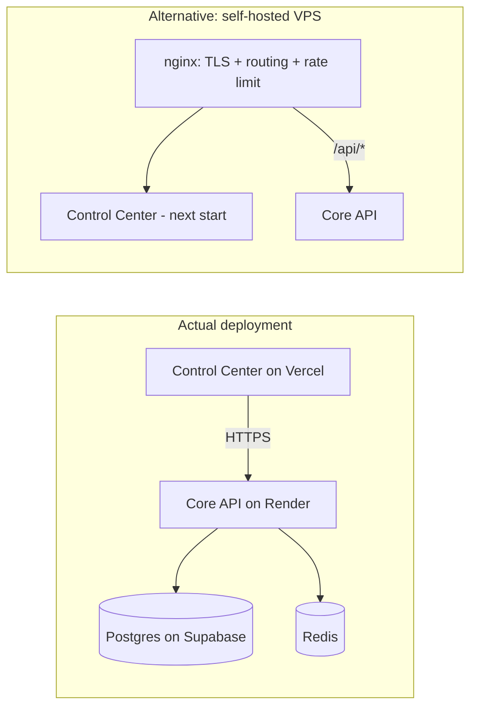

# Phase 13 — Deployment

**Status: the real deployment path (Vercel + Render) was already working
before this phase — the Render outage worked through earlier in this project
was a paused Supabase project, not a code or config problem. This phase adds
everything that was actually missing: a CI gate, a database backup job, a
production `.dockerignore`, a real reverse-proxy config for the self-hosted
alternative, and a desktop release pipeline. Core API's Docker image was
rebuilt and run locally end to end as part of this work (not just
`docker build` — the container was started against real Postgres/Redis and
answered its own health check). The CI and desktop-release workflows could
not be exercised the same way — see "Known gaps."**

## Deployment topology



This project deploys Control Center to Vercel and Core API to Render — both
already terminate TLS and route their own traffic, so most of what "Phase 13
— Deployment" usually means (reverse proxy, TLS, process management) is
already handled by the platforms themselves. `infrastructure/nginx/onegrid.conf`
is for the alternative — a single self-hosted VPS running everything — and
is real, syntax-validated config, not a placeholder, but it's genuinely a
different path than the one this project uses today.

## What was actually missing, and what was built

### 1. Production Docker — verified, not just built

`services/core-api/Dockerfile` already existed and was already correct (it's
what Render itself builds). Added a root `.dockerignore` so the build
context isn't dragging every app's `node_modules` and `.next` cache into
every image build. Then actually ran it:

```
docker build -f services/core-api/Dockerfile -t onegrid-core-api-test .
docker compose --profile full up -d --build core-api
curl http://localhost:4000/api/v1/health
# {"success":true,"data":{"status":"ok", ...}}
```

The container ran the image's own `prisma migrate deploy` on boot, connected
to real Postgres and Redis, and answered a real HTTP request — not just "the
build succeeded."

### 2. CI (`.github/workflows/ci.yml`) — new

Three jobs on every push/PR to `main`:

- **build-lint-typecheck** — `pnpm build`, `pnpm typecheck`, `pnpm lint`
  (turbo-orchestrated across every workspace package).
- **unit-tests** — Core API's mocked specs (`pnpm --filter @nexora/core-api test`),
  no services needed.
- **e2e-tests** — Phase 12's tenant-isolation and RBAC suites, against real
  Postgres (`pgvector/pgvector:pg16`, matching the dev stack) and Redis
  service containers, migrated and seeded exactly like a real deploy would
  be.

Neither Render nor Vercel run this repo's own tests before deploying — they
only check that the build succeeds. This is what actually gates on
correctness before code ships.

### 3. Database backups (`.github/workflows/db-backup.yml`) — new

A nightly `pg_dump`, gzipped and kept as a GitHub Actions artifact for 14
days. Needs a `BACKUP_DATABASE_URL` repository secret — the direct
(non-pooled) Supabase connection string, since `pg_dump` needs session-level
behaviour the transaction pooler doesn't support. Explicitly scoped as a
"quick undo" tool, not long-term archival — the workflow's own header
comment says so and explains how to extend it to S3/R2 if longer retention
is ever needed.

### 4. Desktop release (`.github/workflows/release-desktop.yml`) — new

Tag-triggered (`desktop-v*`) or manual, builds the Organisation Desktop
Tauri app for Windows, macOS and Linux via `tauri-apps/tauri-action` and
publishes the installers as a draft GitHub Release. The app icon set used
for this (`apps/organisation-desktop/src-tauri/icons/`) was regenerated from
the new Sapok OneGrid mark as part of the rebrand earlier in this session.

### 5. Monitoring

`GET /health` now answers a real `503` (not a `200` with `status: "degraded"`
buried in the body) when Postgres or Redis is down — an external monitor
only ever needs the status code, and a uniform `200` regardless of health
would make automated monitoring blind to exactly the failure it exists to
catch. Beyond that: no APM/error-tracking service (Sentry etc.) was wired
in — that needs an account and a DSN only you can create, so it's
recommended rather than built. Point an external uptime monitor (UptimeRobot,
BetterStack, or Render's own health-check-based restart) at `/api/v1/health`
on whichever URL Core API is actually deployed at.

## Verifying it yourself

```bash
docker build -f services/core-api/Dockerfile -t onegrid-core-api .
docker compose --profile full up -d --build core-api
curl http://localhost:4000/api/v1/health
```

To exercise CI for real: push any commit, or open a PR — `.github/workflows/ci.yml`
runs automatically. To take a backup right now instead of waiting for the
nightly schedule: Actions tab → "Database backup" → Run workflow (once
`BACKUP_DATABASE_URL` is set). To cut a desktop release: `git tag
desktop-v0.1.0 && git push origin desktop-v0.1.0`.

## Known gaps / deferred on purpose

- **The CI and desktop-release workflows have not actually been run on
  GitHub** — this environment has no way to push a commit/tag and watch an
  Actions run, so they've been reviewed carefully against documented
  behaviour (the exact build order the working Dockerfile already uses,
  `tauri-action`'s own README) but not exercised. The first real push is
  the first real test — check the Actions tab after pushing this.
- **No Rust/Cargo toolchain in this environment** — `tauri build` itself
  was never run locally. The Tauri icon set was generated and verified
  (that part uses the JS CLI's prebuilt binary, no Cargo needed), but
  whether the Rust side actually compiles clean is untested until the
  release workflow's first real run.
- **No load testing against a production-scale dataset** — named as a gap
  in Phase 12 too; still true here. Nothing in this phase changes that.
- **Backups aren't tested by actually restoring one.** The dump step is
  verified to run and produce a file; restoring it into a fresh database to
  confirm the dump is actually usable hasn't been done.
- **No error-tracking/APM service wired in** (see "Monitoring" above) —
  needs an account this environment can't create.
