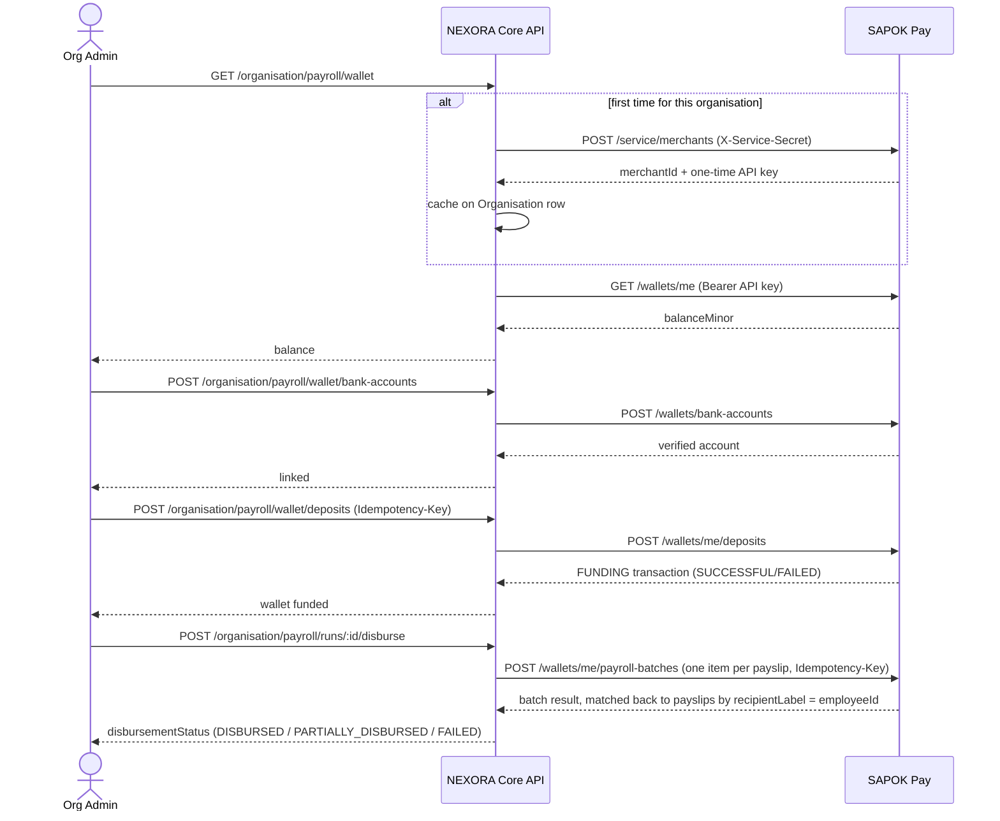
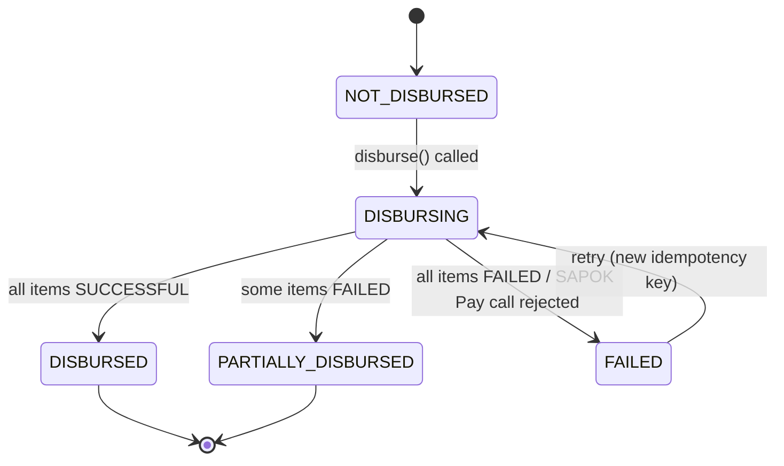
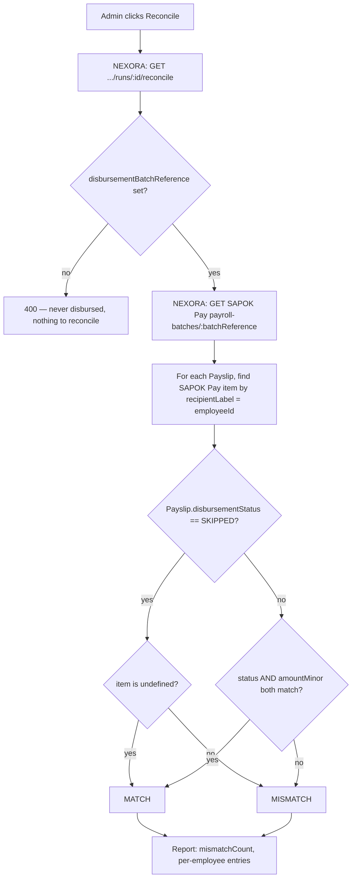

# Phase 6 — NEXORA PAY, via SAPOK Pay

Status: **complete** — all five things Phase 6 named (wallet ledger, bank
connections, payment batches, reconciliation, payslips) are built and
verified end-to-end with real money movement across both systems (both
still using SAPOK Pay's Mock Bank underneath — no real bank is involved
yet on either side). Built in three slices:

1. **Payroll disbursement** — the gap between NEXORA *computing* payroll
   (Phase 5, done) and NEXORA *paying* it. Migrations:
   `20260906093642_phase6_payroll_disbursement`,
   `20260906094409_payroll_disbursement_attempts`.
2. **Wallet visibility + funding** — closing the gap where an
   organisation's SAPOK Pay wallet could only be funded by a manual admin
   adjustment, since the auto-provisioned merchant has no usable login.
3. **Reconciliation + payslip view** (this change) — comparing NEXORA's
   and SAPOK Pay's records of a disbursement, and a proper per-employee
   payslip breakdown in the UI.

## End-to-end flow

An org admin never touches SAPOK Pay directly — every step happens through
NEXORA, which proxies to SAPOK Pay server-side using the organisation's
cached API key:

`PayrollRun.disbursementStatus` moves through a small state machine —
`DISBURSING` exists specifically to reject a second concurrent attempt
(the "already in progress" guard), and `FAILED` is retry-friendly (a fresh
attempt gets its own idempotency key, see the bug note below) while
`DISBURSED`/`PARTIALLY_DISBURSED` are terminal:

## Why this needed a change on the SAPOK Pay side too

The original SAPOK Pay architecture-pivot note always intended "a NEXORA
Organisation being provisioned by Core API is ALSO just a Merchant row
under the hood, created via a privileged service-auth endpoint instead of
public signup" — but that endpoint had never actually been built. Building
it (`POST /service/merchants`, gated by a shared secret) was part of this
slice; see `sapok-pay/README.md`'s "NEXORA integration" section for that
half.

## What was added

- `Organisation.paymentProviderMerchantId` / `paymentProviderApiKey` —
  populated the first time disbursement is attempted for that
  organisation (lazy provisioning, not done at org-creation time).
  **Known gap**: the API key is stored in plain text — no
  encryption-at-rest layer exists anywhere in this platform yet.
- `Employee.bankAccountNumber` / `bankCode` — where payroll disbursement
  pays that employee. Both nullable; an employee without them is
  `SKIPPED` at disbursement time, the same way one without `salaryMinor`
  is skipped by payroll *computation* (Phase 5).
- `PayrollRun.disbursementStatus` (`NOT_DISBURSED` / `DISBURSING` /
  `DISBURSED` / `PARTIALLY_DISBURSED` / `FAILED`) — separate from `status`
  (`COMPLETED`/`CANCELLED`), which is about whether the run's *numbers*
  are valid, not whether the *money has moved*.
- `Payslip.disbursementStatus` (`PAID`/`FAILED`/`SKIPPED`) and
  `disbursementFailureReason` — per-employee outcome.
- `POST /organisation/payroll/runs/:id/disburse` (`payroll:disburse`
  permission) — `services/core-api/src/payouts/`.

## How disbursement works (`PayoutsService.disburseRun`)

1. Reject if the run isn't `COMPLETED`, already `DISBURSED`/
   `PARTIALLY_DISBURSED`, or a disbursement is already `DISBURSING`
   (a concurrent-call guard, not perfectly race-proof without a DB-level
   lock, but cheap and catches the realistic case — a double-click).
2. Split payslips into payable (employee has a bank account) and skipped
   (doesn't) — skipped ones are marked immediately, no SAPOK Pay call
   needed for them.
3. `ensureProvisioned` — lazily provisions the organisation as a SAPOK Pay
   Merchant on first use, caching the merchant ID and API key.
4. Builds one SAPOK Pay payroll-batch request: each payslip becomes
   `{ recipientAccountNumber, amountMinor: netMinor, recipientLabel: employeeId }`.
   **`recipientLabel` carries the NEXORA `employeeId` through SAPOK Pay and
   back** — the per-item result is correlated by that explicit key, not by
   trusting the response array to preserve request order across a network
   boundary.
5. Maps SAPOK Pay's batch status (`COMPLETED`/`PARTIALLY_FAILED`/`FAILED`)
   onto NEXORA's `disbursementStatus` (`DISBURSED`/`PARTIALLY_DISBURSED`/
   `FAILED`), and each item's status onto the matching `Payslip`.

## A real bug this caught, not a hypothetical

First end-to-end run: disbursed a run whose organisation had a freshly
provisioned but **unfunded** (₦0) SAPOK Pay wallet — correctly resulted in
`disbursementStatus: FAILED` and the payslip marked `FAILED` with
"Insufficient wallet balance". Funded the wallet via SAPOK Pay's admin
adjustment endpoint (standing in for a real bank transfer) and retried —
**the retry returned the exact same cached failure**, because the
idempotency key sent to SAPOK Pay was derived only from
`PayrollRun.id`, which doesn't change between attempts. SAPOK Pay's own
idempotency check (working exactly as designed) replayed the first
attempt's stored result forever, so a legitimate retry after fixing the
underlying problem could never succeed.

Fixed by adding `PayrollRun.disbursementAttempts` (incremented on every
attempt, not just successful ones) and deriving the idempotency key as
`nexora-payroll-run-{id}-attempt-{attemptNumber}` — each retry now sends a
genuinely new key. Re-verified: same run, same employee, wallet now
funded, retried and got `disbursementStatus: DISBURSED`, the payslip
`PAID`, and confirmed on the SAPOK Pay side that the merchant's wallet
balance dropped by exactly the net salary amount (hand-verified: funded
₦1,000,000, paid out ₦394,700, wallet showed ₦605,300 remaining).

## Verified

- Employee with a bank account + one without, in the same payroll run —
  disbursement correctly paid one and skipped the other with a clear
  reason, in a single call.
- Insufficient-funds failure, the idempotency bug above, and the
  successful retry after the fix — all with real state checked on both
  NEXORA's and SAPOK Pay's side, not just a 200 response.
- Re-disbursing an already-`DISBURSED` run rejected (`400`); disbursing a
  non-existent run rejected (`404`).

## Slice 2 — wallet visibility and funding (this change)

Slice 1 left a real gap: an organisation's SAPOK Pay wallet could only ever
be funded by a human manually posting an admin adjustment on SAPOK Pay's
own side. Not a real product flow — the auto-provisioned merchant has a
randomly-generated password that's discarded immediately after
provisioning, so nobody can ever log into SAPOK Pay's own dashboard for
it. Slice 2 closes that: NEXORA now proxies the wallet-management calls
itself, using the API key `ensureProvisioned` already caches, so an
organisation never needs a separate SAPOK Pay login at all.

New endpoints, all in `PayoutsService`/`PayrollController`:

| Method | Path | Permission |
|---|---|---|
| GET | `/organisation/payroll/wallet` | `payroll:read` |
| GET | `/organisation/payroll/wallet/bank-accounts` | `payroll:manage_wallet` |
| POST | `/organisation/payroll/wallet/bank-accounts` | `payroll:manage_wallet` |
| POST | `/organisation/payroll/wallet/deposits` | `payroll:manage_wallet` (requires `Idempotency-Key`) |

Frontend: a Wallet card on the Payroll page (balance, bank-account linking,
deposit form) — built in the same pass as the backend, not deferred.

**Verified as one continuous flow, not separately**: fetched the wallet
(triggering first-time provisioning), linked a bank account, attempted a
deposit with no `Idempotency-Key` (`400`), deposited successfully (balance
updated), then created an employee with a modest salary, ran payroll for a
fresh period, and disbursed — landing on `disbursementStatus: DISBURSED` —
entirely through NEXORA endpoints, no SAPOK Pay admin action anywhere in
the loop. Also incidentally re-confirmed two real safety checks along the
way while sizing test numbers: a disbursement attempt against an
under-funded wallet correctly failed (`Insufficient wallet balance`), and
a deposit larger than the Mock Bank's own fixed ₦100,000-per-merchant
starting balance correctly failed at the bank layer instead of silently
succeeding.

## Slice 3 — reconciliation and payslip view (this change)

**Reconciliation** (`PayoutsService.reconcileRun`, `GET
/organisation/payroll/runs/:id/reconcile`, `payroll:read`): fetches the
SAPOK Pay payroll batch by `disbursementBatchReference` and compares every
payslip against it — status and amount must both match, correlated by the
same `recipientLabel = employeeId` convention `disburseRun` already
established. A `SKIPPED` payslip's correct match is "no SAPOK Pay item
exists at all", not a status comparison, since it was never submitted.
This is a **read-only, on-demand** check, not a scheduled job — it answers
"do these two systems still agree right now", not "alert me if they ever
disagree."

**Payslip view** (frontend only, `payroll-page.tsx`): each payslip row in
a run's detail table now expands to show the actual tax computation —
annual gross/pension/taxable/PAYE and the per-band breakdown — using data
`PayrollService.run` already computed and stored (Phase 5); it just wasn't
surfaced anywhere before this.

**Verified**: reconciling an already-disbursed run returned
`mismatchCount: 0` with the NEXORA and SAPOK Pay amounts/statuses matching
exactly; reconciling a run with no `disbursementBatchReference` yet
(never disbursed) correctly rejected (`400`); cross-organisation
reconciliation attempt correctly rejected (`404`).

## What's not built yet

- No webhook consumption — SAPOK Pay fires `payroll_batch.completed`
  webhooks (its own Phase 9), but NEXORA doesn't listen for them yet;
  disbursement status is only ever updated synchronously, in the same
  request that triggered it. This matters once SAPOK Pay's payroll
  batches move to async/background processing (a gap SAPOK Pay's own
  README already flags) — NEXORA will need to consume the webhook instead
  of relying on a synchronous HTTP response.
- Reconciliation is on-demand only — no scheduled job runs it
  automatically, so a drift between the two systems is only caught when
  someone clicks "Reconcile."
- No handling for `payable.length === 0` beyond marking the run `FAILED` —
  no retry-friendly distinction from a real provider failure.
- No payslip PDF/export or employee self-service view (an employee
  viewing their *own* payslip) — the payslip view built here is part of
  the admin/HR-staff run-detail screen, not a standalone document.
