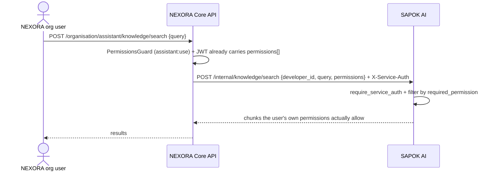

# Phase 7 — NEXORA AI Foundation

**Status: complete, verified end-to-end.**

Superseded from a from-scratch build (the original Phase 7-9 scope: "Python
service, AI gateway, model abstraction, conversations, permissions") into an
**integration** — `sapok-ai` (see `../sapok-ai`) already reached its own full
15-phase roadmap (auth, conversations, streaming, embeddings, knowledge
ingestion, permission-aware retrieval, a tool/action registry, feedback) as
a standalone product before NEXORA needed any of it. Rebuilding that inside
Core API would have meant redoing real, already-verified work. This phase
is the wiring between the two systems, not a second implementation.

## Tenant model: one SAPOK AI Developer per Organisation

Exactly mirrors Phase 6's SAPOK Pay Merchant provisioning
(`PayoutsService.ensureProvisioned`, see
[`phase-6-payroll-disbursement.md`](phase-6-payroll-disbursement.md)):
`AssistantService.ensureProvisioned` signs up one SAPOK AI Developer
account per Organisation, the first time that organisation touches the
assistant, and caches the developer id + API key on the `Organisation` row
(`aiProviderDeveloperId`, `aiProviderApiKey`). An organisation's
conversations and knowledge base can never mix with another's — they live
under entirely separate SAPOK AI accounts, not just separate rows filtered
by a shared tenant column.

Not idempotent by external reference on SAPOK AI's side (unlike SAPOK
Pay's merchant provisioning) — if the cache were ever lost after a
successful signup, the original API key can't be recovered, same
documented gap as the SAPOK Pay integration.

## The design constraint: one permission system, not two

Carried in this repo's own root README since before this phase started:

> Phase 9's tool registry must authorize every AI-initiated action through
> the **same** `PermissionsGuard` / `@RequirePermissions(...)` mechanism
> introduced in Phase 2 — not a parallel ACL system built specifically for
> the AI layer. An AI agent acting on a user's behalf should never be able
> to see or do anything that user's own JWT permissions wouldn't already
> allow via the normal API.

This shaped Phase 7 directly, not just Phase 9: `AssistantService.searchKnowledge`
calls SAPOK AI's **internal, service-authenticated, permission-aware**
endpoint (`POST /internal/knowledge/search`, SAPOK AI's own Phase 9) —
asserting the calling NEXORA user's own JWT permissions
(`actor.permissions`, flattened from their organisation role) — never the
organisation's unrestricted developer-scoped search that
`POST /conversations/.../messages?use_knowledge=true` would use if called
directly. NEXORA never lets a user's assistant session see more than that
user's own role already permits.

## What was built

- **Prisma**: `Organisation.aiProviderDeveloperId` / `aiProviderApiKey`
  (migration `20260906152706_phase7_ai_foundation`) — same plain-text-API-key
  known gap as `paymentProviderApiKey`, needs encryption-at-rest before
  either holds anything that matters in production.
- **Config**: `SAPOK_AI_API_URL`, `SAPOK_AI_SERVICE_SECRET` — must match
  the `SERVICE_AUTH_SECRET` configured in `sapok-ai/api`'s own `.env`.
- **`AssistantService`** (`services/core-api/src/assistant/`) — provisioning,
  conversation proxy (create/list/get/post-message), permission-aware
  knowledge search. Same `fetch`-based service pattern as `PayoutsService`.
- **`AssistantController`** at `organisation/assistant`, gated by a single
  new permission, **`assistant:use`** (seeded into `ORGANISATION_PERMISSIONS`
  and the `assistant` module, added to the Enterprise plan).
- **Shared types/validation**: `packages/types/src/assistant.ts`,
  `packages/validation/src/assistant.ts`.
- **`packages/api-client`**: `apiClient.assistant.*` methods.
- **Frontend** (`apps/organisation-desktop`): `/assistant` page — a
  conversation list, message thread with a composer, and a collapsible
  permission-aware knowledge-search panel. Wired into the sidebar nav,
  gated by `assistant:use` the same way every other nav item is gated by
  its own permission. Type-checks and production-builds cleanly
  (`pnpm --filter @nexora/organisation-desktop build`); not visually
  clicked through in a real browser in this environment — same caveat as
  every other frontend pass documented in
  [`organisation-desktop-frontend.md`](organisation-desktop-frontend.md).

## A real bug found and fixed — in SAPOK AI, not NEXORA

Verifying this integration for real (not just typechecking) surfaced a
genuine latent defect in `sapok-ai/api/app/dependencies.py`'s
`identify_caller`: it returned the raw asyncpg value for
`api_key["developer_id"]` — a `uuid.UUID` object, not a string — while
every "get one specific resource by id" handler in that codebase
(`_get_owned_document`, `_get_owned_conversation`, `_get_owned_action`)
compares it against `str(row["developer_id"])`. A `UUID` object is never
`==` to a `str` even when they represent the same id, so those endpoints
silently 404'd for **any** API-key-authenticated caller — JWT auth was
unaffected, since a JWT's `sub` claim is already a string.

This had been latent since SAPOK AI's own Phase 3/4 and went undetected
through that project's entire 15-phase build and its 56-test suite,
because every prior verification of a "get owned resource by id" endpoint
happened to use a developer JWT, never an API key — `list`/`create`
endpoints (which only ever pass `developer_id` into a SQL parameter, never
a Python string comparison) were tested via API key and passed, masking
the gap. NEXORA's integration was the first real caller whose cached
credential is an API key used for repeat calls, which is exactly the
shape that exposed it. Fixed at the source (`identify_caller` now returns
`str(...)` in the API-key branch) and covered by a new regression test
(`test_api_key_can_fetch_a_specific_owned_resource_by_id`) exercising all
three affected resource types — see `sapok-ai/README.md`'s own Phase 14
section and `sapok-ai/api/tests/test_auth.py`.

## Verified end-to-end over real HTTP

Both services running for real (SAPOK AI on `:4200`, NEXORA Core API on
`:4000`, real Postgres for each): platform admin created a fresh
organisation, provisioned its first org admin, reseeded so that admin's
`SUPER_ADMIN` role picked up the new `assistant:use` permission, logged
in, then — through NEXORA's own API, never calling SAPOK AI directly —
created a conversation (which transparently provisioned a real SAPOK AI
Developer account behind the scenes), posted a message and received a
real `PlaceholderProvider` reply, fetched the conversation back with its
full message history, listed conversations, and ran a permission-aware
knowledge search (empty — no documents ingested yet, Phase 8's job — but
returning cleanly, not erroring). Missing auth on every assistant route
returned `401`.

## Known gaps / deferred on purpose

- No document ingestion into SAPOK AI from NEXORA's own business data yet
  — knowledge search works, but has nothing to find until Phase 8
  ("NEXORA Knowledge — document ingestion, embeddings, pgvector, RAG").
- No business-action tools (e.g. "run payroll," "approve leave" as
  AI-callable, human-approved actions) — that's Phase 9's explicit scope
  ("NEXORA AI Actions — tool registry, authorized business actions,
  approval workflows"), and needs SAPOK AI's own action-approval Phase 11
  wired through NEXORA's `PermissionsGuard` the same way knowledge search
  now is.
- `aiProviderApiKey` stored in plain text on the `Organisation` row — see
  the `paymentProviderApiKey` known gap this mirrors exactly.
- No retry/backoff on SAPOK AI calls — a transient network blip surfaces
  as a `ValidationApiException` to the caller today, same as every SAPOK
  Pay call in `PayoutsService`.
