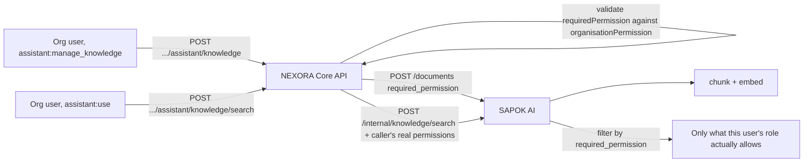
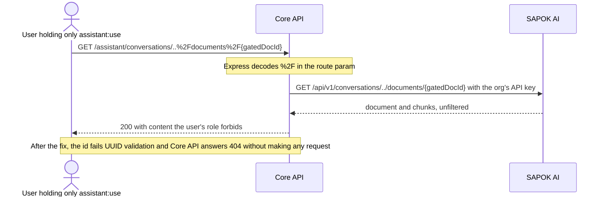

# Phase 8 — NEXORA Knowledge

**Status: complete and verified end-to-end. A later security review found and fixed
two authorization bugs in this phase's read endpoints — see "Security review" below.**

Superseded the same way Phase 7 was: the roadmap's original scope ("document
ingestion, embeddings, pgvector, RAG") already exists as a real, verified
capability in `sapok-ai` (its own Phase 7/8). This phase is the wiring that
lets an organisation put its own real text content into that pipeline —
not a second ingestion/embedding/vector-search implementation inside Core
API.

## Not the same thing as Phase 5's Documents

NEXORA already has a `Document` model (Phase 5) — but it stores
`fileUrl`, `category`, `expiryDate`: file *attachments* (an employee's ID
scan, a signed contract), not extracted text. There is no
file-fetching/text-extraction capability anywhere in this stack that would
let a `fileUrl` be ingested into SAPOK AI meaningfully, and an employee's
personal file isn't something you'd want the assistant able to quote back
in a chat response anyway.

"Knowledge" here is a deliberately separate, smaller concept: a **text**
entry — a policy, an FAQ, a handbook excerpt — that an organisation
explicitly wants the assistant able to retrieve. `AssistantKnowledgeEntry`
(`@nexora/types`) is intentionally its own type, not an extension of
`OrganisationDocument`.

## What was built

- **`AssistantService`** (Phase 7's class, extended): `createKnowledgeEntry`,
  `listKnowledgeEntries`, `getKnowledgeEntry`, `deleteKnowledgeEntry` — pure
  proxies to SAPOK AI's `POST/GET/DELETE /documents` (its own Phase 7/8),
  same "proxy, don't duplicate" shape as every other SAPOK integration in
  this codebase. No new NEXORA database table — SAPOK AI is the source of
  truth for knowledge content, the same way SAPOK Pay is for wallet
  balances.
- **`required_permission` validated before ingesting**: when a knowledge
  entry names a `requiredPermission`, `AssistantService` checks it against
  this organisation's real permission catalog (`organisationPermission`)
  first. An unrecognised key would otherwise silently create an entry no
  role could ever be granted access to.
- **New permission, `assistant:manage_knowledge`**: separate from
  `assistant:use` — adding/removing what the assistant can retrieve is a
  more sensitive, admin-like action than chatting or searching it, same
  "one permission per real capability" split as `payroll:read` vs
  `payroll:manage_settings`. `AssistantController`'s knowledge-management
  routes override the controller-level `assistant:use` requirement with
  this stricter one.
- **Frontend**: a "Manage knowledge" panel on `/assistant`, gated by
  `assistant:manage_knowledge` (invisible to a user who only has
  `assistant:use`) — add an entry with an optional required-permission
  dropdown sourced from the organisation's real permission catalog, list
  existing entries with status/chunk-count/gating badges, delete. The
  existing knowledge-search panel now also shows which permission (if any)
  gated a result in.

## Verified end-to-end over real HTTP

Both services running for real. Created a fresh organisation with two
users: the SUPER_ADMIN (every permission, including `payroll:read`) and a
custom `LIMITED` role holding only `assistant:use`. As the admin: ingested
a `payroll:read`-gated "Payroll Policy" entry and an ungated "General
FAQ", and confirmed an unrecognised permission key (`not_a_real_permission`)
was rejected with `400` before reaching SAPOK AI at all. Searched "net pay
calculation" as the **admin** — got both results back, Payroll Policy
ranked first by relevance. Searched the identical query as the **limited
user** — got back only the ungated General FAQ; Payroll Policy did not
appear at all. Deleted the Payroll Policy entry and confirmed it was gone
from the list. Confirmed the limited user's attempt to create a knowledge
entry was rejected with `403 MISSING_PERMISSION` (they hold `assistant:use`
but not `assistant:manage_knowledge`). Frontend type-checks and
production-builds cleanly.

## Security review: two authorization bugs found and fixed

**Status: found after this phase was marked verified — the "Verified"
section above tested search and management, not reading a gated entry back.**

A security review of the assistant endpoints (an automated DAST scan
couldn't run — the `hawk` CLI isn't installed and there's no API key — so
this was a manual probe with a real two-role setup) found the following
in code this phase introduced. Both were reproduced against the running
services before being fixed.

1. **A gated entry's content was readable by anyone with `assistant:use`.**
   `GET /organisation/assistant/knowledge/:id` proxied SAPOK AI's
   unrestricted developer-scoped document read and only required
   `assistant:use`, so a user without `payroll:read` got the full text of a
   `payroll:read`-gated entry back (`200`). `GET /knowledge` also listed
   every gated entry's title to them. The permission-aware **search** —
   the path this phase was designed around — was correct; the two
   read-by-id/list routes beside it simply didn't apply the same rule.
2. **Path traversal through every route that takes an id.** Route ids were
   interpolated straight into the outbound SAPOK AI URL. Express decodes
   `%2F` in route params, so `conversations/..%2Fdocuments%2F<id>` became a
   request to a *different* SAPOK AI endpoint — made with the organisation's
   own API key and none of NEXORA's permission checks. It returned the same
   gated document, so fixing (1) alone would not have closed the hole.

**The fixes** (`AssistantService`):

- Every id is validated as a bare UUID **where the outbound URL is built**
  (`safeId`), not only in the controller, so no future caller can skip it. A
  malformed id is a `404`, and no request leaves the process.
- `getKnowledgeEntry` enforces the entry's `requiredPermission` against the
  caller's own JWT permissions. A caller who fails it gets the same `404` as a
  nonexistent id — never a `403` that would confirm the entry exists. This
  applies to knowledge managers too: managing what the assistant knows does
  not imply being allowed to read payroll policy.
- `listKnowledgeEntries` hides entries the caller lacks the permission for.
  `assistant:manage_knowledge` holders still see every entry's *metadata*
  (the list carries no content) so they can manage and delete them.

**Verified** by re-running the identical probe: the same user got `404` for
the read, `404` for the traversal, saw one entry instead of two in the list,
and search still returned nothing gated; the admin holding `payroll:read`
still read the content (`200`). Edge cases: a knowledge manager without
`payroll:read` sees the gated entry in the list, gets `404` reading it, and can
still delete it; traversal attempts through the feedback, message-post and
delete routes all returned `404`.

**Regression tests.** `src/assistant/assistant.service.spec.ts` is Core API's
first spec (jest was installed but had no config, so no TypeScript test could
run; a `jest.config.js` and a `tsconfig.build.json` that keeps specs out of
`dist/` were added). It has 14 tests, no database and no network. They were
checked to actually catch the bug: with the fix temporarily disabled, 9 of 14
fail — exactly the ones covering these vulnerabilities — and with it
restored all 14 pass.

## Known gaps / deferred on purpose

- No bulk import, no file upload — one text entry at a time, pasted in
  directly. Nothing today generates enough real knowledge-base volume to
  justify more than that.
- No edit — updating an entry means deleting and re-creating it. SAPOK AI
  itself has no update-in-place endpoint for a document's content either
  (re-chunking/re-embedding on edit is a real design question, not
  obviously cheap, and not decided).
- Still no business-action tools (Phase 9's explicit scope) — this phase
  is retrieval only.
