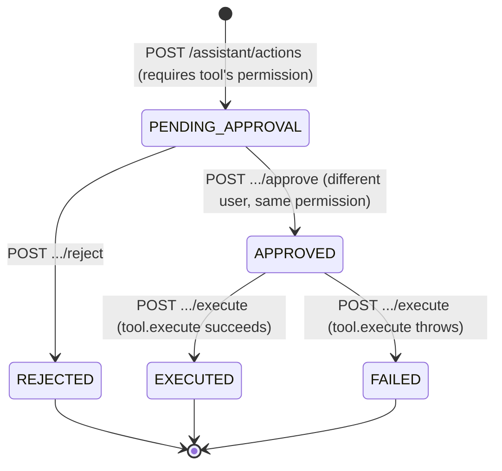

# Phase 9 — NEXORA AI Actions

**Status: complete, verified end-to-end.**

The roadmap's own scope for this phase — "tool registry, authorized
business actions, approval workflows" — implies a different shape than
Phase 7/8. Those two were *integrations*: point NEXORA at an already-built,
already-verified `sapok-ai` capability. This phase couldn't be, because the
actions in question (disbursing payroll, for instance) are **NEXORA
business logic**, gated by **NEXORA's own RBAC** — SAPOK AI has no
knowledge of either and no way to enforce them. So Phase 9 is a real,
NEXORA-native action-approval system, deliberately not a second
implementation of SAPOK AI's own action registry and not a reuse of its
`action_requests` table.

## Why this couldn't live in SAPOK AI

SAPOK AI's own Phase 11 (`action_requests`, `ActionTool`, propose ->
approve -> execute) is a real, well-proven pattern — genuinely reused
*as a design*, just not as literal rows or code, because its `execute()`
runs entirely inside SAPOK AI's own process against SAPOK AI's own
database. A NEXORA business action's real side effect lives in NEXORA
(and, transitively, in SAPOK Pay) — reusing SAPOK AI's table would mean
SAPOK AI calling back into NEXORA over HTTP to actually do anything,
inventing a whole new bidirectional trust boundary on top of an already-
completed, already-tested standalone product, to save building one Prisma
model. Not worth it for one action tool.

## The design constraint, actually enforced

This repo's own carried-forward note: "Phase 9's tool registry must
authorize every AI-initiated action through the **same**
`PermissionsGuard`/`@RequirePermissions(...)` mechanism introduced in
Phase 2." Concretely: every registered `AssistantActionTool` declares one
`requiredPermission` — the *exact* permission its equivalent direct
endpoint already requires (`payroll:disburse` for the one tool that
exists today). `AssistantActionsService` checks
`actor.permissions.includes(tool.requiredPermission)` at propose, approve,
reject, and execute — the same `permissions[]` array a static
`@RequirePermissions(...)` decorator reads, just resolved dynamically
since a static decorator can't know which tool a request body names ahead
of time.

## Maker-checker: a real constraint, not a suggestion

The one propose->approve->execute state machine SAPOK AI already proved
(`PENDING_APPROVAL -> APPROVED -> EXECUTED`/`FAILED`, or `-> REJECTED`)
gets one addition here that SAPOK AI's own didn't need: **the proposer can
never also be the approver**, even if they hold the required permission
twice over (e.g. an organisation's only admin). Real financial ops
practice, enforced server-side (`SELF_APPROVAL_FORBIDDEN`), not just hidden
in the UI — someone could otherwise script around a client-side-only check.

## What was built

- **`assistant_action_requests`** (new Prisma model, its own table —
  `organisationId`, `toolName`, `arguments` (JSON), `reasoning`, `status`,
  `result`, `proposedById`, `decidedById`, timestamps). `proposedById`/
  `decidedById` are plain strings, not foreign keys — same reasoning as
  `AuditLog.actorId`.
- **`AssistantActionTool`** interface + registry
  (`assistant-action-registry.ts`) — deliberately separate from the
  read-side of the assistant (conversations, knowledge search); nothing
  read-only could ever reach a mutating tool through this registry.
- **`DisbursePayrollRunTool`** — the first, and so far only, registered
  action. Wraps `PayoutsService.disburseRun` (Phase 6) exactly as-is; the
  approval gate sits in front of it, nothing about the underlying method
  changed. Chosen for the same reason SAPOK AI's own first action tool was
  deletion: real money leaving the organisation, irreversible once SAPOK
  Pay processes it — the clearest "never AI-initiated alone" example
  available.
- **`AssistantActionsService`** — propose/list/get/approve/reject/execute,
  the permission + maker-checker enforcement, and honest failure handling:
  if `tool.execute()` throws (a real SAPOK Pay outage, in testing), the
  action is recorded `FAILED` with the real error message before the error
  is re-thrown to the caller — never left stuck in `APPROVED` limbo.
- **Frontend**: an "Actions" panel on `/assistant` — pick a registered
  tool, fill its arguments (today: a payroll run id), optional reasoning,
  propose; a list of proposed actions with status badges and
  approve/reject/execute buttons, the approve button disabled (with an
  explanatory tooltip) when the viewer is the action's own proposer — a
  UX hint only, the real enforcement is server-side.

## Verified end-to-end over real HTTP, across all three services

NEXORA Core API, SAPOK AI, and **SAPOK Pay** all running for real (this is
the first NEXORA phase whose verification genuinely needed all three).
Created an organisation with two SUPER_ADMIN users, an employee, and ran a
real payroll for September 2026. As admin #1: proposed
`disburse_payroll_run`. Confirmed admin #1 approving their own proposal
was rejected with `403 SELF_APPROVAL_FORBIDDEN`, and executing before
approval was rejected with `400`. As admin #2: approved it, then executed
it — `PayoutsService.disburseRun` ran for real (a genuine call to a
running SAPOK Pay), and its real result (the payroll run, including SAPOK
Pay's own batch reference) was recorded on the action as `EXECUTED`. A
first attempt made before SAPOK Pay was started failed with a real network
error and was correctly recorded `FAILED` with that error message, not
left hanging — proof the failure path works, not just the happy path.
Frontend type-checks and production-builds cleanly.

## Known gaps / deferred on purpose

- Exactly one action tool. Adding a second means writing its
  `AssistantActionTool` implementation and adding it to the registry's
  constructor — the mechanism doesn't need to change.
- No automatic proposal — nothing decides to call `POST /assistant/actions`
  on its own; every stage is a separate, explicit, human-authenticated
  request. There is no real reasoning model yet that could make that
  decision (same honest gap SAPOK AI documents for its own tool registry).
- `list`/`get` on an action request are visible to anyone with
  `assistant:use`, not filtered to the tool's own `requiredPermission` —
  a deliberate, considered choice: the record itself (which tool, whose
  proposal, what status) reveals no business data more sensitive than an
  audit-log entry would. Revisit if a future action tool's arguments ever
  carry something that assumption doesn't hold for.
- No maker-checker override for a genuinely solo-admin organisation
  (today, such an org simply cannot execute this class of action through
  the assistant surface at all — the direct
  `POST /organisation/payroll/runs/:id/disburse` endpoint still works for
  them, unaffected). Revisit if that turns out to matter in practice.
